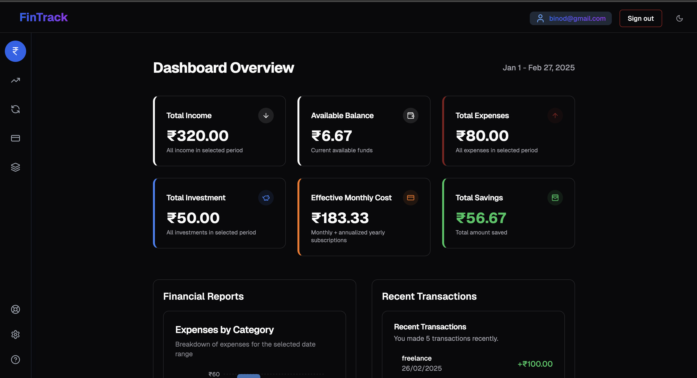

# FinTrack 📊💰

**FinTrack** is a modern, full-featured personal finance dashboard built with **Next.js**, **Tailwind CSS**, and **TypeScript**. It empowers you to effortlessly manage your income, expenses, investments, and subscriptions—all in one beautifully designed interface.

---

## ✨ Features

- **Dynamic Dashboard:** Visualize your financial health with interactive charts and key metrics.
- **Income & Expenses Tracking:** Easily record and monitor your cash flow.
- **Investments & Subscriptions:** Keep an eye on your investments and recurring bills.
- **Responsive & Modern UI:** Enjoy a sleek, mobile-friendly design powered by Tailwind CSS.
- **Supabase Integration:** Secure, real-time data management with Supabase.
- **Smooth Animations:** Experience delightful transitions with Framer Motion.

---

## 🚀 Getting Started

### Prerequisites

Ensure you have the following installed:
- [Node.js](https://nodejs.org/) (v16 or later)  
- [npm](https://www.npmjs.com/) or [pnpm](https://pnpm.io/)

### Installation

1. **Clone the Repository:**

   ```bash
   git clone https://github.com/akshay0611/fintrack.git
   cd fintrack
   ```

2. **Install Dependencies:**

   Using npm:
   ```bash
   npm install
   ```

   Or using pnpm:
   ```bash
   pnpm install
   ```

3. **Configure Environment Variables:**

   Create a `.env.local` file in the project root and add your environment variables. For example:

   ```env
   NEXT_PUBLIC_SUPABASE_URL=your-supabase-url
   NEXT_PUBLIC_SUPABASE_ANON_KEY=your-supabase-anon-key
   ```

4. **Run the Development Server:**

   Using npm:
   ```bash
   npm run dev
   ```

   Or using pnpm:
   ```bash
   pnpm dev
   ```

   Open [http://localhost:3000](http://localhost:3000) in your browser to see FinTrack in action! 🌐

---

## 📊 Expense Tracking Overview

Get insights into your spending habits with categorized expense breakdowns.




---

## 🚀 Deployment

FinTrack is designed to be seamlessly deployed on [Vercel](https://vercel.com/).

To create a production build, run:

```bash
vercel build
```

Then, deploy your project with:

```bash
vercel --prod
```

---

## 🤝 Contributing

We welcome contributions and feedback! If you'd like to enhance FinTrack, please:

- **Fork** the repository.
- **Create a new branch** for your feature or bug fix.
- **Submit a pull request** with a detailed description of your changes.

Feel free to open an issue if you have any questions or ideas. Let’s build something great together! 👏

---

## 📄 License

This project is licensed under the [MIT License](LICENSE).

---

Happy tracking your finances and happy coding! 💸😄
